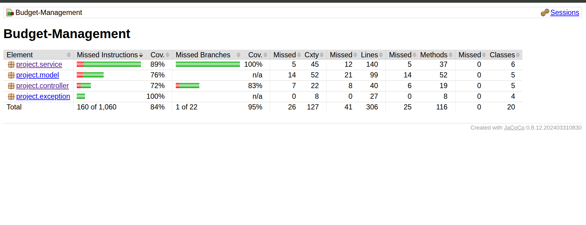
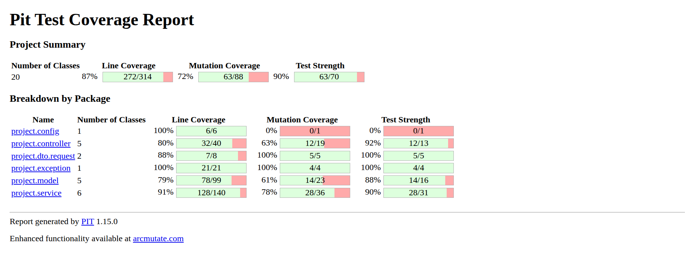
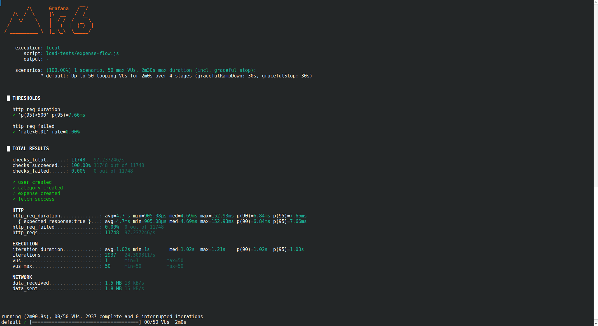

# Budget Management System

A Spring Boot REST API for managing personal expenses, categories, friends, and expense sharing.

This project was developed as a Software Testing course project and demonstrates RESTful API design, layered
architecture, automated testing, code coverage analysis, and mutation testing.

---

## Features

- User management
- Category management
- Expense management
- Expense participant management
- Friend management
- Global exception handling
- PostgreSQL database
- Flyway database migrations
- JUnit 5 automated tests
- JaCoCo code coverage reports
- PIT mutation testing

---

## Technology Stack

| Technology           | Version |
|----------------------|---------|
| Java                 | 17      |
| Spring Boot          | 3.3     |
| Spring MVC           | ✓       |
| Spring Data JPA      | ✓       |
| PostgreSQL           | 16      |
| Flyway               | ✓       |
| Gradle Kotlin DSL    | ✓       |
| JUnit 5              | ✓       |
| MockMvc              | ✓       |
| JaCoCo               | ✓       |
| PIT Mutation Testing | ✓       |

---

## Project Structure

```
src
├── main
│   ├── java
│   │   └── project
│   │       ├── controller
│   │       ├── service
│   │       ├── repository
│   │       ├── model
│   │       ├── dto
│   │       ├── exception
│   │       └── BudgetApplication
│   └── resources
│       ├── application.properties
│       └── db
│           └── migration
│
└── test
    └── java
        └── project
            ├── controller
            ├── service
            └── e2e
```

---

## Requirements

- Java 17+
- PostgreSQL
- Gradle

---

## Database Configuration

Create a PostgreSQL database:

```sql
CREATE
DATABASE budget_db;
```

Configure `application.properties`:

```properties
spring.datasource.url=jdbc:postgresql://localhost:5432/budget_db
spring.datasource.username=postgres
spring.datasource.password=your_password
spring.jpa.hibernate.ddl-auto=validate
spring.jpa.show-sql=true
spring.flyway.enabled=true
```

---

## Running the Application

Clone the repository:

```bash
git clone <repository-url>
cd Budget-Management
```

Run:

```bash
./gradlew bootRun
```

The application starts on

```
http://localhost:8080
```

---

## Running Tests

Run all tests:

```bash
./gradlew test
```

Run a specific test:

```bash
./gradlew test --tests "project.controller.UserControllerTest"
```

---

## JaCoCo Code Coverage

Generate coverage report:

```bash
./gradlew clean test jacocoTestReport
```

Open:

```
build/reports/jacoco/test/html/index.html
```



---

## Mutation Testing (PIT)

Run mutation tests:

```bash
./gradlew clean pitest
```

Report location:

```
build/reports/pitest/index.html
```



---
## Run Load Tests
Run load tests with:

```bash
./run-load-tests.sh
```

Output:



---

## Test Strategy

The project includes tests for:

- Controller layer
- Service layer
- Repository interactions
- Exception handling
- Validation
- Edge cases
- Error responses

MockMvc is used to verify REST endpoints.

---

## API Overview

### Users

| Method | Endpoint |
|--------|----------|
| POST   | /users   |

---

### Categories

| Method | Endpoint             |
|--------|----------------------|
| POST   | /categories/{userId} |
| GET    | /categories/{userId} |

---

### Expenses

| Method | Endpoint           |
|--------|--------------------|
| POST   | /expenses/{userId} |
| GET    | /expenses/{userId} |

---

### Friends

| Method | Endpoint          |
|--------|-------------------|
| POST   | /friends/{userId} |
| GET    | /friends/{userId} |

---

## Exception Handling

The application provides centralized exception handling for:

- Bad Request
- Resource Not Found
- Resource Already Exists
- Missing Request Parameters

Errors are returned in JSON format.

Example:

```json
{
  "status": 404,
  "error": "Not Found",
  "message": "Category not found",
  "timestamp": "2026-07-10T12:30:15"
}
```

---

## Quality Assurance

The project includes:

- Unit testing
- Integration testing
- End-to-end testing
- Code coverage analysis using JaCoCo
- Mutation testing using PIT

These techniques help verify both functional correctness and test quality.

---

## Future Improvements

- Authentication and authorization
- Docker support
- Testcontainers for isolated database testing
- Swagger/OpenAPI documentation
- Input validation using Bean Validation
- CI/CD pipeline
- Pagination and filtering
- Docker Compose deployment

---

## Authors

Software Testing Course Project and Ali Moradzade

Developed using Spring Boot and PostgreSQL.
